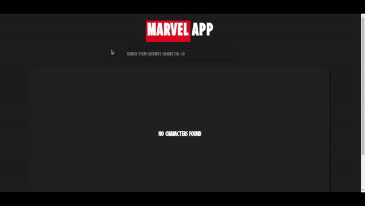

# Marvel App

Página para pesquisa de personagens da Marvel através do consumo de sua [API](https://developer.marvel.com/).

# Tecnologias utilizadas
- [TypeScript](https://www.typescriptlang.org/)
- [ReactJS](https://reactjs.org/)
- [Styled-Components](https://styled-components.com/)

# Interface



# Requisitos mínimos
Ter o [Node.js](https://nodejs.org/en/download/) instalado na sua máquina.

# Como executar

```bash

# clone o repositório
git clone https://github.com/wendellmoraisz/MarvelApp.git

# entre no diretório do projeto e execute os seguintes comandos no seu terminal:
npm install
npm start
```
